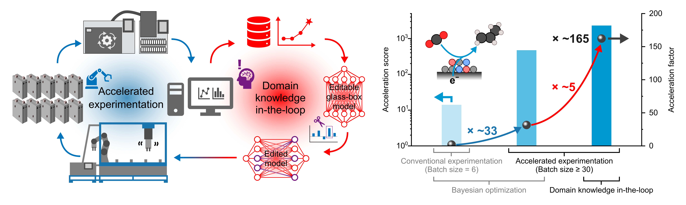

# Accelerated discovery of CO₂-to-C₃ hydrocarbon electrocatalysts with human-in-the-loop

## Overview


## Citation

If you use this code, data, or methodology in your research, please cite the following paper:

Kim, J., *et al.*  
*Accelerated discovery of CO₂-to-C₃ hydrocarbon electrocatalysts with human-in-the-loop.*  
**Joule** **9**, 102213 (2025).  
https://doi.org/10.1016/j.joule.2025.102213

```bibtex
@article{Kim2025CO2toC3,
  title   = {Accelerated discovery of CO$_2$-to-C$_3$ hydrocarbon electrocatalysts with human-in-the-loop},
  author  = {Kim, Jiheon and Mahesh, Suhas and Lee, Hyeon Seok and Dorakhan, Roham and Bai, Yang and Imran, Muhammad and Li, Kangming and Liu, Yutong and Kim, Dongha and Park, Sungjin and Shayanesth Zeraati, Ali and Moon, Hyun Sik and Li, Xiaodong and Arabyarmohammadi, Fatemeh and Abed, Jehad and Wander, Brook and Wu, Chengqian and Liu, Shijie and Xiao, Yurou Celine and Miao, Rui Kai and Hoogland, Sjoerd and Hattrick-Simpers, Jason and Sargent, Edward H. and Sinton, David},
  journal = {Joule},
  year    = {2025},
  volume  = {9},
  pages   = {102213},
  doi     = {10.1016/j.joule.2025.102213}
}
```

## Repository
https://github.com/jiheonkim10/CO2_to_C3
